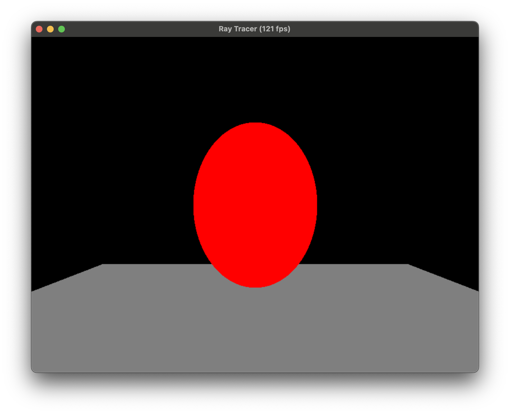

# Ray Tracer Development Log

## Project Overview
A simple ray tracer built in C++ to learn about ray tracing techniques and graphics programming.

## Current Features
- Basic ray tracing implementation
- Sphere rendering
- WASD camera movement
- Real-time FPS counter
- OpenGL-based display

## Devlog 1
So far I have a basic ray tracer that can render spheres. You can move the camera around with WASD and the FPS counter is displayed in the window title. I think the next step is to add a light source and render a more complex scene.

## Devlog 2
The main feature add here is the addition of a cuboid (rectangular prism).
More behind the scenes, though, is a transition to using transformation matrices,
and leveraging the concepts of object, world, and camera space.

